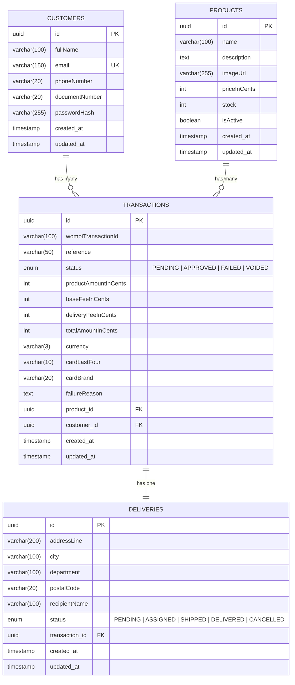

# Vertex Store

> E-commerce single-page application for purchasing AirPods products with credit card payment processing through Wompi.

**Live Demo:** [https://d1vqynim1uo5mq.cloudfront.net/](https://d1vqynim1uo5mq.cloudfront.net/)

---

## Table of Contents

- [Overview](#overview)
- [Tech Stack](#tech-stack)
- [Architecture](#architecture)
- [Data Model](#data-model)
- [API Documentation](#api-documentation)
- [5-Step Checkout Flow](#5-step-checkout-flow)
- [Project Structure](#project-structure)
- [Setup & Installation](#setup--installation)
- [Running Tests](#running-tests)
- [Deployment](#deployment)
- [Security](#security)

---

## Overview

Vertex Store is a full-stack e-commerce application that implements a complete checkout flow with real payment processing via the [Wompi](https://wompi.com/) payment gateway. The app manages stock, customers, transactions, and deliveries — following a 5-step screen business process:

```
1. Product Page → 2. Credit Card / Delivery Info → 3. Summary → 4. Final Status → 5. Product Page
```

Key features:

- Product catalog with real-time stock tracking
- Secure credit card tokenization (card data never touches our backend)
- Installment payment support (1, 3, 6, 12, 24, 36 installments)
- Transaction status polling with automatic Wompi synchronization
- Webhook support for asynchronous payment confirmation
- Session resilience — checkout progress persists through page refresh via localStorage
- JWT-based authentication with registration and login
- Responsive mobile-first design (minimum: iPhone SE 375px)

---

## Tech Stack

### Frontend

| Technology             | Purpose                              |
| ---------------------- | ------------------------------------ |
| React 19               | UI framework (SPA)                   |
| TypeScript             | Type safety                          |
| Redux Toolkit (RTK)    | State management (Flux architecture) |
| RTK Query              | API data fetching and caching        |
| Material UI (MUI) 7    | Component library with custom theme  |
| React Router v7        | Client-side routing                  |
| Vite 7                 | Build tool and dev server            |
| Jest + Testing Library | Unit testing                         |

### Backend

| Technology      | Purpose                              |
| --------------- | ------------------------------------ |
| NestJS 11       | API framework (Node.js / TypeScript) |
| TypeORM         | ORM for PostgreSQL                   |
| PostgreSQL      | Relational database                  |
| Passport + JWT  | Authentication                       |
| bcrypt          | Password hashing                     |
| class-validator | DTO validation                       |
| Helmet          | Security headers                     |
| Jest            | Unit testing                         |

### Infrastructure

| Service        | Purpose                                  |
| -------------- | ---------------------------------------- |
| AWS CloudFront | Frontend CDN (HTTPS)                     |
| AWS S3         | Frontend static hosting + product images |
| AWS (Backend)  | API hosting                              |

---

## Architecture

The project follows a **layered architecture** inspired by **Hexagonal Architecture (Ports & Adapters)** and applies **Railway Oriented Programming (ROP)** for use case execution.

```
┌─────────────────────────────────────────────────────────┐
│                      FRONTEND (SPA)                     │
│  React + Redux Toolkit + RTK Query                      │
│  ┌──────────┐ ┌──────────┐ ┌──────────┐ ┌──────────┐   │
│  │ Product  │→│ Checkout │→│ Summary  │→│  Result  │   │
│  │  Page    │ │   Page   │ │   Page   │ │   Page   │   │
│  └──────────┘ └──────────┘ └──────────┘ └──────────┘   │
│       ↕ Store (Redux + localStorage persistence)        │
└──────────────────────┬──────────────────────────────────┘
                       │ HTTPS
┌──────────────────────▼──────────────────────────────────┐
│                     BACKEND (API)                        │
│                                                          │
│  ┌─────────────── Presentation Layer ───────────────┐   │
│  │  Controllers · Global Filters · Interceptors      │   │
│  │  (TransformInterceptor wraps all in ApiResponse)  │   │
│  └──────────────────────┬───────────────────────────┘   │
│                         │                                │
│  ┌─────────────── Business Layer ───────────────────┐   │
│  │  Services (Result<T,E> / ROP pattern)             │   │
│  │  AuthService · ProductsService · TransactionsServ │   │
│  │  DeliveriesService · CustomersService · WompiServ │   │
│  └──────────────────────┬───────────────────────────┘   │
│                         │                                │
│  ┌─────────────── Data Layer ───────────────────────┐   │
│  │  TypeORM Repositories · Entities · Migrations     │   │
│  └──────────────────────┬───────────────────────────┘   │
│                         │                                │
│                    PostgreSQL                            │
└─────────────────────────────────────────────────────────┘
```

### Railway Oriented Programming (ROP)

All service methods return `Result<T, E>` — a discriminated union type that enforces explicit success/failure handling:

```typescript
type Result<T, E> =
  | { isSuccess: true; value: T }
  | { isSuccess: false; error: E };
```

Helper functions `ok()`, `fail()`, `mapResult()`, and `chainResult()` enable composable pipelines:

```typescript
// Example: TransactionsService.createPending()
const stockResult = await this.productsService.hasStock(dto.productId);
if (!stockResult.isSuccess) return fail(stockResult.error);
if (!stockResult.value) return fail("Product is out of stock");
// ...continues the railway
```

Controllers unwrap results and throw the appropriate HTTP exceptions, keeping business logic free of HTTP concerns.

---

## Data Model



### Entity Relationships

| Relationship            | Type        | Description                                         |
| ----------------------- | ----------- | --------------------------------------------------- |
| Customer → Transactions | One-to-Many | A customer can have multiple purchase transactions  |
| Product → Transactions  | One-to-Many | A product can be purchased in multiple transactions |
| Transaction → Delivery  | One-to-One  | Each transaction generates exactly one delivery     |

### Key Design Decisions

- **Prices in cents**: All monetary values are stored as integers (cents) to avoid floating-point precision issues. For COP: `110000000` = $1,100,000 COP.
- **UUID primary keys**: All entities use UUID v4 for IDs, preventing enumeration attacks.
- **Soft stock management**: Stock is decremented only when a transaction is `APPROVED`, not when created.
- **Separate fees**: `baseFeeInCents` and `deliveryFeeInCents` are stored per transaction for auditability.

---

## API Documentation

Base URL: `{API_HOST}/api/v1`

### Postman Collection

A complete Postman collection with all API endpoints, examples, and environment variables is available in the repository:

📁 **[Vertex.postman_collection.json](Vertex.postman_collection.json)**

To use it:

1. Open Postman
2. Click **Import** → **Upload Files**
3. Select `Vertex.postman_collection.json`
4. Configure the environment variables (`API_HOST`, `ACCESS_TOKEN`)

---

All successful responses are wrapped in:

```json
{
  "success": true,
  "data": { ... },
  "timestamp": "2026-03-01T00:00:00.000Z"
}
```

Error responses follow:

```json
{
  "statusCode": 400,
  "message": "Validation error message",
  "error": "Bad Request",
  "timestamp": "2026-03-01T00:00:00.000Z",
  "path": "/api/v1/..."
}
```

### Authentication

| Method | Endpoint         | Auth | Description                 |
| ------ | ---------------- | ---- | --------------------------- |
| `POST` | `/auth/register` | No   | Register a new customer     |
| `POST` | `/auth/login`    | No   | Login and receive JWT token |

<details>
<summary><strong>POST /auth/register</strong></summary>

**Request Body:**

```json
{
  "fullName": "Juan Pérez",
  "email": "juan@example.com",
  "phoneNumber": "+573001234567",
  "documentNumber": "1234567890",
  "password": "securePass123"
}
```

**Validations:**

- `fullName`: string, 2–100 characters
- `email`: valid email format, unique
- `phoneNumber`: string, 7–20 characters
- `documentNumber`: string, 5–20 characters
- `password`: string, min 8 characters

**Response (201):**

```json
{
  "success": true,
  "data": {
    "accessToken": "eyJhbGciOiJIUzI1NiIs...",
    "customer": {
      "id": "uuid",
      "fullName": "Juan Pérez",
      "email": "juan@example.com",
      "phoneNumber": "+573001234567",
      "documentNumber": "1234567890"
    }
  }
}
```

</details>

<details>
<summary><strong>POST /auth/login</strong></summary>

**Request Body:**

```json
{
  "email": "juan@example.com",
  "password": "securePass123"
}
```

**Validations:**

- `email`: valid email format
- `password`: string, min 8 characters

**Response (201):**

```json
{
  "success": true,
  "data": {
    "accessToken": "eyJhbGciOiJIUzI1NiIs...",
    "customer": { ... }
  }
}
```

**Error (401):** Invalid credentials

</details>

---

### Products

| Method | Endpoint        | Auth | Description                         |
| ------ | --------------- | ---- | ----------------------------------- |
| `GET`  | `/products`     | No   | List all active products with stock |
| `GET`  | `/products/:id` | No   | Get a single product by UUID        |

<details>
<summary><strong>GET /products</strong></summary>

**Response (200):**

```json
{
  "success": true,
  "data": [
    {
      "id": "uuid",
      "name": "AirPods Pro (2nd Generation)",
      "description": "Immersive audio experience...",
      "imageUrl": "https://vertex-store-assets.s3.us-east-2.amazonaws.com/airpodsPro-2gen.jpg",
      "priceInCents": 110000000,
      "stock": 10,
      "isActive": true,
      "createdAt": "2026-01-01T00:00:00.000Z"
    }
  ]
}
```

</details>

<details>
<summary><strong>GET /products/:id</strong></summary>

**Parameters:**

- `id`: UUID (validated with `ParseUUIDPipe`)

**Response (200):** Single product object  
**Error (404):** Product not found

</details>

---

### Transactions

| Method  | Endpoint                   | Auth | Description                                             |
| ------- | -------------------------- | ---- | ------------------------------------------------------- |
| `POST`  | `/transactions`            | JWT  | Create a pending transaction and initiate Wompi payment |
| `GET`   | `/transactions/:id`        | JWT  | Get transaction with auto-sync from Wompi               |
| `PATCH` | `/transactions/:id/status` | JWT  | Manually update transaction status                      |

<details>
<summary><strong>POST /transactions</strong></summary>

**Headers:** `Authorization: Bearer {token}`

**Request Body:**

```json
{
  "productId": "uuid",
  "card": {
    "token": "tok_test_...",
    "installments": 1
  },
  "delivery": {
    "addressLine": "Calle 123 #45-67",
    "city": "Bogotá",
    "department": "Cundinamarca",
    "postalCode": "110111"
  },
  "customerIp": "192.168.1.1"
}
```

**Validations:**

- `productId`: valid UUID, product must exist and have stock
- `card.token`: non-empty string (Wompi tokenized card)
- `card.installments`: integer, 1–36
- `delivery.addressLine`: string, 5–200 characters
- `delivery.city`: string, 2–100 characters
- `delivery.department`: string, 2–100 characters
- `delivery.postalCode`: string, 0–20 characters

**Business Logic:**

1. Validates product stock availability
2. Calculates total: `productPrice + baseFee ($30,000) + deliveryFee ($20,000)`
3. Generates unique reference (`VS-{timestamp}-{shortId}`)
4. Creates integrity signature (SHA-256)
5. Fetches Wompi acceptance token
6. Creates transaction + delivery in a DB transaction
7. Sends payment to Wompi
8. Returns pending transaction

**Response (201):** Full transaction object with product, customer, and delivery relations

</details>

<details>
<summary><strong>GET /transactions/:id</strong></summary>

**Headers:** `Authorization: Bearer {token}`

If the transaction is `PENDING` and has a `wompiTransactionId`, the backend automatically fetches the latest status from Wompi before responding. On `APPROVED`, stock is decremented and delivery status is updated.

**Response (200):** Full transaction object

</details>

---

### Deliveries

| Method | Endpoint                                    | Auth | Description                      |
| ------ | ------------------------------------------- | ---- | -------------------------------- |
| `GET`  | `/deliveries/:id`                           | JWT  | Get delivery by UUID             |
| `GET`  | `/deliveries/by-transaction/:transactionId` | JWT  | Get delivery by transaction UUID |

---

### Customers

| Method | Endpoint         | Auth | Description                      |
| ------ | ---------------- | ---- | -------------------------------- |
| `POST` | `/customers`     | No   | Create a customer (without auth) |
| `GET`  | `/customers/:id` | No   | Get customer by UUID             |

---

### Webhooks

| Method | Endpoint          | Auth      | Description                          |
| ------ | ----------------- | --------- | ------------------------------------ |
| `POST` | `/webhooks/wompi` | Signature | Receive Wompi payment status updates |

The webhook validates the event signature using SHA-256 with the Wompi integrity key, processes `transaction.updated` events, and applies the final status (`APPROVED` / `FAILED`).

---

## 5-Step Checkout Flow

```
┌──────────┐    ┌──────────┐    ┌──────────┐    ┌──────────┐    ┌──────────┐
│    1.    │    │    2.    │    │    3.    │    │    4.    │    │    5.    │
│ Product  │───▶│ Checkout │───▶│ Summary  │───▶│  Result  │───▶│ Product  │
│   Page   │    │   Page   │    │   Page   │    │   Page   │    │   Page   │
└──────────┘    └──────────┘    └──────────┘    └──────────┘    └──────────┘
     │               │               │               │               │
  Browse &       Card info &     Review order    Payment result   Back to
  select         delivery        & confirm       (polling)        store
  product        address
```

### Resilience (Refresh Recovery)

The checkout state is persisted to `localStorage` at each step:

- `selectProduct` → saves selected product
- `setCardAndDelivery` → saves tokenized card + delivery info
- `setTransaction` → saves transaction result

On page refresh, the Redux store is rehydrated from `localStorage`, allowing the user to continue from where they left off. Route guards in `App.tsx` ensure users can only access steps they've completed:

- `/checkout` requires a selected product
- `/summary` requires card info
- `/result` requires a transaction

---

## Project Structure

```
vertex-store/
├── README.md
├── backend/
│   └── src/
│       ├── main.ts                          # App bootstrap (Helmet, CORS, ValidationPipe)
│       ├── app.module.ts                    # Root module
│       ├── core/
│       │   ├── filters/                     # GlobalExceptionFilter
│       │   └── interceptors/                # LoggingInterceptor, TransformInterceptor
│       ├── database/
│       │   ├── entities/                    # TypeORM entities (Customer, Product, Transaction, Delivery)
│       │   ├── migrations/                  # Database migrations
│       │   ├── seeds/                       # Product seed data
│       │   ├── data-source.ts               # TypeORM DataSource config
│       │   └── database.module.ts           # Database module
│       ├── modules/
│       │   ├── auth/                        # Authentication (JWT, bcrypt)
│       │   ├── customers/                   # Customer CRUD
│       │   ├── deliveries/                  # Delivery queries
│       │   ├── products/                    # Product catalog
│       │   ├── transactions/                # Transaction lifecycle + Wompi webhook
│       │   └── wompi/                       # Wompi payment gateway integration
│       └── shared/
│           ├── constants/                   # Fee constants, currency
│           └── utils/                       # Result (ROP), card utils, reference generator
│
└── frontend/
    └── src/
        ├── App.tsx                          # Route definitions with step guards
        ├── main.tsx                         # React root with providers
        ├── pages/                           # ProductPage, CheckoutPage, SummaryPage, ResultPage
        ├── components/
        │   ├── auth/                        # LoginModal, RegisterModal
        │   └── layout/                      # AppLayout (AppBar, responsive container)
        ├── store/
        │   ├── store.ts                     # Redux store configuration
        │   ├── api/                         # RTK Query endpoints (base, auth, products, transactions)
        │   └── slices/                      # Auth slice, Checkout slice (with localStorage)
        ├── shared/constants/                # Fee constants
        ├── utils/                           # Currency formatting, Wompi card tokenization
        └── theme/                           # MUI custom theme (Apple-inspired)
```

---

## Setup & Installation

### Prerequisites

- Node.js >= 18
- PostgreSQL >= 14
- pnpm (backend) / npm (frontend)

### Backend

```bash
cd backend

# Install dependencies
pnpm install

# Configure environment variables
cp .env.example .env
# Edit .env with your values (see table below)

# Run database migrations
pnpm run migration:run

# Seed products
pnpm run seed

# Start in development mode
pnpm run start:dev
```

#### Backend Environment Variables

| Variable              | Description                | Default                                   |
| --------------------- | -------------------------- | ----------------------------------------- |
| `PORT`                | Server port                | `3000`                                    |
| `API_PREFIX`          | API route prefix           | `api/v1`                                  |
| `NODE_ENV`            | Environment                | `development`                             |
| `DB_HOST`             | PostgreSQL host            | `localhost`                               |
| `DB_PORT`             | PostgreSQL port            | `5432`                                    |
| `DB_USERNAME`         | Database user              | `vertex_user`                             |
| `DB_PASSWORD`         | Database password          | `vertex_password`                         |
| `DB_NAME`             | Database name              | `vertex_store`                            |
| `JWT_SECRET`          | Secret for JWT signing     | _(required)_                              |
| `JWT_EXPIRES_IN`      | Token expiration           | `24h`                                     |
| `CORS_ORIGIN`         | Allowed frontend origin    | `http://localhost:5173`                   |
| `WOMPI_API_URL`       | Wompi API base URL         | `https://api-sandbox.co.uat.wompi.dev/v1` |
| `WOMPI_PUBLIC_KEY`    | Wompi public key           | _(required)_                              |
| `WOMPI_PRIVATE_KEY`   | Wompi private key          | _(required)_                              |
| `WOMPI_INTEGRITY_KEY` | Wompi integrity/events key | _(required)_                              |

### Frontend

```bash
cd frontend

# Install dependencies
npm install

# Configure environment variables
cp .env.example .env
# Edit .env with your values

# Start development server
npm run dev
```

#### Frontend Environment Variables

| Variable                | Description          | Example                                   |
| ----------------------- | -------------------- | ----------------------------------------- |
| `VITE_API_URL`          | Backend API base URL | `http://localhost:3000/api/v1`            |
| `VITE_WOMPI_API_URL`    | Wompi public API     | `https://api-sandbox.co.uat.wompi.dev/v1` |
| `VITE_WOMPI_PUBLIC_KEY` | Wompi public key     | `pub_test_...`                            |

---

## Running Tests

### Backend

```bash
cd backend

# Run all unit tests
pnpm run test

# Run tests with coverage report
pnpm run test:cov

# Run tests in watch mode
pnpm run test:watch
```

**Backend Coverage: 98.12% Statements | 81.36% Branches | 100% Functions | 98.62% Lines**

18 test suites · 106 tests

### Frontend

```bash
cd frontend

# Run all unit tests
npm test

# Run tests with coverage report
npm run test:coverage
```

**Frontend Coverage: 91.34% Statements | 84.90% Branches | 80% Functions | 90.99% Lines**

16 test suites · 133 tests

### Combined: 239 tests | Both projects exceed 80% coverage threshold on all metrics

---

## Deployment

The application is deployed on **AWS**:

| Component          | Service                   | URL                                                                              |
| ------------------ | ------------------------- | -------------------------------------------------------------------------------- |
| **Frontend**       | AWS S3 + CloudFront (CDN) | [https://d1vqynim1uo5mq.cloudfront.net/](https://d1vqynim1uo5mq.cloudfront.net/) |
| **Product Images** | AWS S3                    | `vertex-store-assets.s3.us-east-2.amazonaws.com`                                 |
| **Backend API**    | AWS                       | Served over HTTPS                                                                |
| **Database**       | PostgreSQL                | Managed instance                                                                 |

The frontend is served via CloudFront with **HTTPS** enabled, providing global edge caching and secure connections.

---

## Security

The application implements several security best practices aligned with **OWASP** guidelines:

| Measure                   | Implementation                                                                                      |
| ------------------------- | --------------------------------------------------------------------------------------------------- |
| **HTTPS**                 | CloudFront enforces HTTPS for all frontend traffic                                                  |
| **Security Headers**      | `helmet()` middleware sets X-Content-Type-Options, X-Frame-Options, Strict-Transport-Security, etc. |
| **CORS**                  | Restricted to specific frontend origin                                                              |
| **Input Validation**      | `class-validator` with `whitelist: true` and `forbidNonWhitelisted: true` prevents mass assignment  |
| **Password Hashing**      | bcrypt with 10 salt rounds                                                                          |
| **Sensitive Data**        | `passwordHash` has `select: false` — never returned in API responses                                |
| **JWT Authentication**    | Bearer token with configurable expiration                                                           |
| **UUID Keys**             | Prevents sequential ID enumeration attacks                                                          |
| **Card Security**         | Card numbers are tokenized client-side via Wompi — raw card data never reaches the backend          |
| **Webhook Validation**    | SHA-256 signature verification on Wompi webhooks                                                    |
| **SQL Injection**         | Prevented by TypeORM parameterized queries                                                          |
| **Global Error Handler**  | Internal errors return generic messages; stack traces are never exposed to clients                  |
| **Transaction Integrity** | Database transactions with rollback on failure                                                      |
